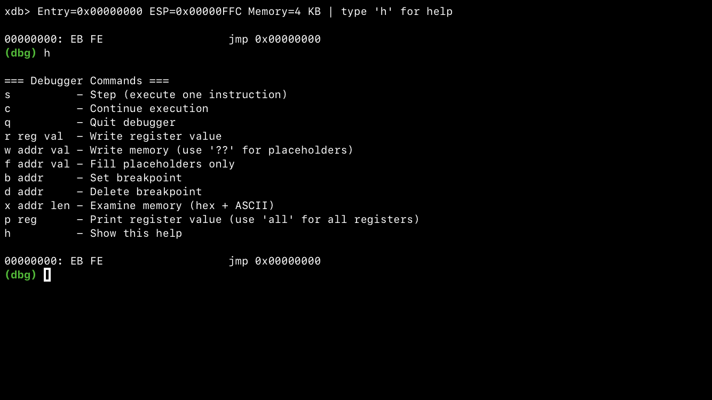

# xdb



- x86 32-bit instruction interpretation and execution
- Interactive step-by-step debugger
- Register and memory inspection and modification
- Breakpoints and execution flow analysis

## Usage

```bash
./xdb <program.bin>
```

## Purpose

xdb is intended as a study and experimentation tool, allowing analysis of how x86 instructions are decoded, executed, and how they affect CPU and memory state
